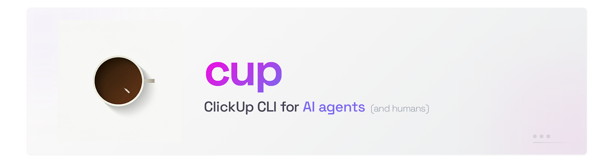

<p align="center">
  
</p>

<p align="center">
  <a href="https://www.npmjs.com/package/@krodak/clickup-cli"></a>
  <a href="https://nodejs.org"></a>
  <a href="./LICENSE"></a>
  <a href="https://github.com/krodak/clickup-cli/actions/workflows/ci.yml"></a>
  <a href="https://github.com/krodak/homebrew-tap"></a>
</p>

```bash
npm install -g @krodak/clickup-cli && cup init
```

## For AI Agents

Paste this into any AI agent (Claude Code, Codex, Cursor, OpenCode, etc.):

```
Install and configure the ClickUp CLI for me. Fetch the setup guide from:
https://raw.githubusercontent.com/krodak/clickup-cli/main/skills/clickup-cli/SKILL.md

Then walk me through installing the CLI, getting a ClickUp API token,
and running cup init. Finally, install the skill with `cup skill` so
you have persistent access to the full command reference.
```

The fetched SKILL.md contains everything the agent needs: install commands,
where to get a ClickUp API token, non-interactive setup with `cup init --token --team`,
and the complete command reference. After setup, the agent can run any `cup` command
to manage your tasks, sprints, comments, time tracking, and more.

**Already have the CLI installed?** Just run `cup skill` to install the agent skill to
all detected locations (see [Set up your agent](#set-up-your-agent) below).

## Talk to your agent

Install the CLI, add the skill file to your agent, and it works with ClickUp. No API knowledge needed.

> **"Read task abc123, do the work, then mark it in review and leave a comment with the commit hash."**

> **"What's my standup? What did I finish, what's in progress, what's overdue?"**

> **"Create a subtask under the initiative for the edge case we found."**

> **"Check my sprint and tell me what's behind schedule."**

> **"Update the description with your findings and flag blockers in a comment."**

The agent reads the skill file, picks the right `cup` commands, and handles everything. You don't need to learn the CLI - the agent does.

### Terminal mode (TTY)

Task listing commands (`cup tasks`, `cup search`, `cup sprint`, etc.) present an interactive picker — navigate with arrow keys or j/k, Space to select tasks, Enter to confirm. Selected tasks show full details and offer to open in the browser. Other prompts (sprint disambiguation, delete confirmations) also use interactive selection.


### Agent / piped mode

When piped (no TTY), the same commands output clean Markdown (or JSON with `--json`). No prompts, no colors — designed for agents and pipelines.


## Why a CLI and not MCP?

A CLI + skill file has fewer moving parts. No server process, no protocol layer. The agent already knows how to run shell commands - the skill file teaches it which ones exist. For tool-use with coding agents, CLI + instructions tends to work better than MCP in practice.

## Install

You need Node 22+ and a ClickUp personal API token (`pk_...` from [ClickUp Settings > Apps](https://app.clickup.com/settings/apps)).

<details open>
<summary>&nbsp;&nbsp;<strong>npm</strong></summary>

```bash
npm install -g @krodak/clickup-cli
cup init
cup auth  # verify setup
```

</details>

<details>
<summary>&nbsp;&nbsp;<strong>Homebrew</strong></summary>

```bash
brew tap krodak/tap
brew install clickup-cli
cup init
cup auth  # verify setup
```

</details>

## Set up your agent

After installing `cup`, run:

```bash
cup skill
```

This detects which agents you have (Claude Code, Codex, OpenCode) and installs the [skill file](https://agentskills.io) to the right locations. Run it again after updating `cup` to refresh the skill.

<details>
<summary>Manual install options</summary>

<details>
<summary>&nbsp;&nbsp;<strong>Claude Code</strong></summary>

**Install as a [plugin](https://docs.anthropic.com/en/docs/claude-code/plugins)** (recommended):

```bash
claude plugin add $(npm root -g)/@krodak/clickup-cli
```

**Or as a personal skill:**

```bash
cup skill --path ~/.claude/skills/clickup/SKILL.md
```

</details>

<details>
<summary>&nbsp;&nbsp;<strong>Codex</strong></summary>

```bash
cup skill --path ~/.agents/skills/clickup/SKILL.md
```

Or for a project-level skill:

```bash
cup skill --path .agents/skills/clickup/SKILL.md
```

</details>

<details>
<summary>&nbsp;&nbsp;<strong>OpenCode</strong></summary>

```bash
cup skill --path ~/.config/opencode/skills/clickup/SKILL.md
```

</details>

<details>
<summary>&nbsp;<strong>Other agents / npx</strong></summary>

Without installing globally, you can use `npx`:

```bash
npx @krodak/clickup-cli skill --print > SKILL.md
```

Or install the skill directly from GitHub via the [skills CLI](https://github.com/vercel-labs/skills):

```bash
npx skills add https://github.com/krodak/clickup-cli
```

</details>

</details>

## What it covers

Full CRUD for the core ClickUp workflow:

| Area                 | Capabilities                                                                                                                                                                                         |
| -------------------- | ---------------------------------------------------------------------------------------------------------------------------------------------------------------------------------------------------- |
| ✅ **Tasks**         | Create, read, update, delete, duplicate, merge, search, subtasks, assign (users and groups), dependencies, links, multi-list, bulk operations (status, assign, due-date, tag, priority, field, move) |
| 💬 **Comments**      | Post, edit, delete by ID or by task scope for your own comments, threaded replies, notify all, list and view comments                                                                                |
| 🗨️ **Chat**          | List channels, send messages, replies, reactions, channel management                                                                                                                                 |
| 📄 **Docs**          | List, read, create, edit, delete (v3 API)                                                                                                                                                            |
| ⏱️ **Time Tracking** | Start/stop timer, log entries, list/update/delete history, per-user time estimates                                                                                                                   |
| ☑️ **Checklists**    | View, create, delete, add/edit/delete items                                                                                                                                                          |
| 🔧 **Custom Fields** | List, create, set, remove values (text, number, dropdown, labels, date, checkbox, url, email, rating, progress, relationship, people)                                                                |
| 🏷️ **Tags**          | Add/remove on tasks, space-level create/update/delete                                                                                                                                                |
| 🎯 **Goals & OKRs**  | Goals CRUD, key results CRUD                                                                                                                                                                         |
| 🏃 **Sprints**       | Auto-detect active sprint, `sprint:current` pseudo-ID for move/create, flexible date parsing, config override, favorite sprint folders                                                               |
| ⭐ **Favorites**     | Local favorites for quick access to sprint folders, spaces, lists, folders, views, tasks                                                                                                             |
| 👁️ **Views**         | List, get, create, update, delete views on lists                                                                                                                                                     |
| 🔗 **Webhooks**      | List, create, update, delete webhooks; scope to space, folder, list, or task                                                                                                                         |
| 🏢 **Workspace**     | Spaces, folders, lists (full CRUD + rename + from template), members, user groups, task types, templates, plan, shared hierarchy                                                                     |
| 📎 **Attachments**   | Upload files to tasks, list task attachments, shown in detail views                                                                                                                                  |

[Full API coverage details](docs/api-coverage.md) | [Command reference](docs/commands.md)

## Configuration

### Profiles

Multiple profiles for different workspaces or accounts:

```bash
cup profile add work        # interactive setup
cup profile add personal    # another workspace
cup profile list            # show all profiles
cup profile use personal    # switch default
cup tasks -p work           # one-off profile override
```

### Config file

`~/.config/cup/config.json` (or `$XDG_CONFIG_HOME/cup/config.json`):

```json
{
  "defaultProfile": "work",
  "profiles": {
    "work": {
      "apiToken": "pk_...",
      "teamId": "12345678",
      "sprintFolderId": "optional"
    },
    "personal": {
      "apiToken": "pk_...",
      "teamId": "87654321"
    }
  }
}
```

Old flat configs (pre-profiles) are auto-migrated on first load.

### Environment variables

Environment variables override config file values:

| Variable       | Description                                                       |
| -------------- | ----------------------------------------------------------------- |
| `CU_API_TOKEN` | ClickUp personal API token (`pk_`)                                |
| `CU_TEAM_ID`   | Workspace (team) ID                                               |
| `CU_PROFILE`   | Profile name (overrides `defaultProfile`, overridden by `-p`)     |
| `CU_OUTPUT`    | Set to `json` to force JSON output when piped (default: markdown) |

When both `CU_API_TOKEN` and `CU_TEAM_ID` are set, the config file is not required. Useful for CI/CD and containerized agents.

```bash
cup auth  # verify setup
```

### Non-interactive setup

For CI, scripts, and AI agents, you can skip the interactive prompts:

```bash
# Write config directly
cup init --token pk_YOUR_TOKEN --team YOUR_TEAM_ID

# Or use environment variables (no config file needed)
export CU_API_TOKEN=pk_YOUR_TOKEN
export CU_TEAM_ID=YOUR_TEAM_ID
```

## Troubleshooting

**"No config file found"** - Run `cup init` to set up your API token and workspace.

**"Config missing apiToken"** - Set `CU_API_TOKEN` environment variable or run `cup init`.

**No output from `cup`** - Make sure you're on v1.5.2+. Older versions had a symlink bug. Update: `npm install -g @krodak/clickup-cli`

**Sprint not detected** - Your sprint folder needs "sprint", "iteration", "cycle", or "scrum" in the name. Or pin it: `cup config set sprintFolderId <id>`. You can also favorite a sprint folder: `cup favorite add sprint-folder <id>`

**Custom field filter fails** - `--field` requires `--list` to resolve field names to IDs: `cup tasks --list <id> --field "Sprint" "Week 1"`

**Wrong workspace** - Switch profile: `cup profile use <name>` or use `-p <name>` for one command.

## Development

```bash
npm install
npm test          # unit tests (vitest, tests/unit/)
npm run test:e2e  # e2e tests (tests/e2e/, requires CLICKUP_API_TOKEN in .env.test)
npm run build     # tsup -> dist/
```
