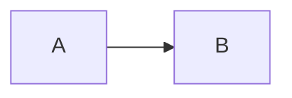

# ClickUp Flavored Markdown (CUFM)

**Read this file before writing or updating a ClickUp task description.**

`cup create`, `cup update`, and `cup task-sync push` compile CUFM to ClickUp’s native editor document. That is how headings stay tight, tables keep column widths, and mermaid becomes an image plus a toggle with the source.

This dialect is **task descriptions only**. Do not use CUFM in `cup comment` / `reply` / `comment-edit` — comments use a different converter.

Unknown `::components` are preserved as a fenced `cufm` code block rather than dropped.

## How to ship a description

Write CUFM to a file, then pass the file. Do not put rich markdown in inline `-d` (shell quoting breaks backticks, apostrophes, and fences).

```bash
cup create -n "Title" -l <listId> --description-file /tmp/desc.md
cup update <taskId> --description-file /tmp/desc.md
cup task-sync push notes.md              # file that lives next to the work
cup task-sync push ./tasks               # directory of parent/subtasks
```

`--description-file -` reads stdin.

## Standard Markdown

Headings (`#`–`####`), **bold**, _italic_, ~~strike~~, `code`, [links](https://example.com), nested lists, GFM tables, task lists (`- [ ]` / `- [x]`), fenced code, `---` dividers, and `` images.

Relative image paths are uploaded on push as `cup-{sha1}.ext` and embedded. Do not wrap the body in HTML. Do not use `<details>` for toggles.

## Attributes

Comark `{...}` after an element:

````mdc
# Centered {align="center"}
Right aligned {align="right"}
{width="640"}
[underline]{underline}
[Red]{highlight="red"}
[pink]{color="pink"}
Green on green {color="green" background="green"}
```json {lineNumbers}
{"ok": true}
```
````

Base color tokens (text, highlight, badge, block background, banners):

`grey`, `red`, `orange`, `yellow`, `green`, `blue`, `purple`, `pink`

Banners also support a `-strong` variant of each base (`pink-strong`, `blue-strong`, …). Text, highlight, badge, and block background channels use only base colors.

## Block components

```mdc
::toc
::

::toggle{title="Details"}
Hidden body. Nested toggles use extra colons:

  :::toggle{title="Nested"}
  Inner body
  :::
::

::banner{color="blue"}
Callout body
::

::banner{color="pink-strong" icon="😱"}
Banner with emoji
::

::quote{size="large"}
Pull quote
::

::columns
  :::column{width="0.33"}
  Left
  :::
  :::column{width="0.33"}
  Middle
  :::
  :::column{width="0.34"}
  Right
  :::
::

::button{url="https://example.com" color="#646464"}
Click me
::

::frame{src="https://example.com" height="480"}
::

::table{widths="288,288,288"}
| Foo | Bar | Baz |
| --- | --- | --- |
| a   | b   | c   |
::

::mermaid{theme="github-light" width="640"}
flowchart LR
  A --> B
::
```

GitHub alerts become banners: `NOTE` → blue, `TIP` → green, `IMPORTANT` → purple, `WARNING` → yellow, `CAUTION` → pink-strong.

```mdc
> [!NOTE]
> Useful context
```

## Inline components

```mdc
:badge[Red]{color="red"}
:user[Colin]{id="2685610"}
:task[86bbhau05]
:doc{view="26aqt-259" page="26aqt-84"}
```

`<@userId>` also becomes a real ClickUp mention (numeric id from `cup members`).

## Mermaid

A fenced `mermaid` block (or `::mermaid`) is rendered to PNG, uploaded, embedded, then followed by a toggle titled **mermaid source** containing the original source as inline-code lines. ClickUp does not preserve block-code attributes inside toggle list items. Default theme is `github-light`. Override with `::mermaid{theme="tokyo-night"}` or `cup task-sync push --mermaid-theme`.

````md

````

If rendering fails, the source toggle is still kept.

## Tables

Wrap a GFM table in `::table{widths="120,360"}` to set column widths in pixels. Without `widths`, cup estimates from cell text (`8 * chars + 24`, clamped 75–708).

## task-sync frontmatter

A directory of markdown files is one graph. Child `parent:` is canonical. Parent `subtasks:` is display order plus a check. `depends_on` / `blocks` are waiting-on edges. Refs are relative paths or ClickUp ids.

```yaml
---
clickup_id: 86bbhau05
title: Task name
list_id: '901400901320'
parent: ./epic.md
subtasks:
  - ./child.md
depends_on:
  - ./setup.md
blocks:
  - ./release.md
---
```

```bash
cup task-sync init <taskId> notes.md
cup task-sync init <taskId> ./tasks/     # parent + nested subtasks
cup task-sync push ./tasks
cup task-sync pull ./tasks
```

`parent: null` unparents. Omitting `parent:` does not. Push creates missing tasks parents-first, then descriptions, then **adds** missing dependency edges (it does not delete remote edges).
