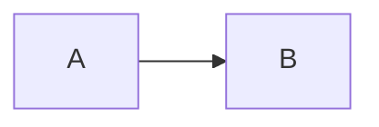

# ClickUp Flavored Markdown (CUFM)

**Read this file before writing or updating a ClickUp task description.**

`cup create`, `cup update`, and `cup task-sync push` compile CUFM to ClickUp’s native editor document. That is how headings stay tight, tables keep column widths, and Mermaid/tldraw diagrams become images plus toggles with their source.

This dialect is **task descriptions only**. Do not use CUFM in `cup comment` / `reply` / `comment-edit` — comments use a different converter.

Unknown `::components` are preserved as a fenced `cufm` code block rather than dropped.

## How to ship a description

Write CUFM to a file, then pass the file. Do not put rich markdown in inline `-d` (shell quoting breaks backticks, apostrophes, and fences).

```bash
cup create -n "Title" -l <listId> --description-file /tmp/desc.md
cup update <taskId> --description-file /tmp/desc.md
cup task-sync push notes.md              # file that lives next to the work
cup task-sync push ./tasks               # directory of parent/subtasks
```

`--description-file -` reads stdin.

## Standard Markdown

Headings (`#`–`####`), **bold**, _italic_, ~~strike~~, `code`, [links](https://example.com), nested lists, GFM tables, task lists (`- [ ]` / `- [x]`), fenced code, `---` dividers, and `` images.

Relative image paths are uploaded on push as `cup-{sha1}.ext` and embedded. Do not wrap the body in HTML. Do not use `<details>` for toggles.

### Line breaks and list indentation

ClickUp stores one block per line, so a few ordinary markdown habits do not mean what they look like:

- **Separate every block with a blank line.** A single newline inside a paragraph is a markdown soft break, which collapses to a space: `Line one\nline two` becomes `Line one line two`. Do not hard-wrap prose.
- **Nest ordered items by three spaces**, not two — the indent must clear the `1. ` marker. Two spaces makes the child a sibling and renumbers it (`1.` / `2.` / `3.` instead of `1.` / `1.` / `2.`). Bullets nest by two, and `- [ ]` items nest by two.
- **Do not rely on lazy continuation lines inside a list item.** An unmarked line indented under `- item` is folded onto the item's own line.
- Trailing-double-space hard breaks become separate blocks; use a blank line instead.

## Attributes

Comark `{...}` after an element:

````mdc
# Centered {align="center"}
Right aligned {align="right"}
{width="640"}
[underline]{underline}
[Red]{highlight="red"}
[pink]{color="pink"}
Green block {background="green"}
```json {lineNumbers}
{"ok": true}
```
````

Base color tokens (text, highlight, badge, block background, banners):

`grey`, `red`, `orange`, `yellow`, `green`, `blue`, `purple`, `pink`

Banners also support a `-strong` variant of each base (`pink-strong`, `blue-strong`, …). Text, highlight, badge, and block background channels use only base colors.

ClickUp keeps a block background but resets inline text color in the same paragraph, so use `color` and `background` on separate lines.

## Block components

```mdc
::toc
::

::toggle{title="Details"}
Hidden body. Nested toggles may use extra colons for readability, but plain
`::` nests correctly too — a lossless pull always writes the `::` form:

  :::toggle{title="Nested"}
  Inner body
  :::
::

::banner{color="blue"}
Callout body
::

::banner{color="pink-strong" icon="😱"}
Banner with emoji
::

::quote{size="large"}
Pull quote
::

::columns
  :::column{width="0.33"}
  Left
  :::
  :::column{width="0.33"}
  Middle
  :::
  :::column{width="0.34"}
  Right
  :::
::

::button{url="https://example.com" color="#646464"}
Click me
::

::frame{src="https://example.com" height="480"}
::

::table{widths="288,288,288"}
| Foo | Bar | Baz |
| --- | --- | --- |
| a   | b   | c   |
::

::mermaid{theme="github-light" width="640"}
flowchart LR
  A --> B
::

::tldraw{width="640"}
<complete .tldr JSON>
::

::sync-block{id="aa751cde-1335-4328-8359-2774c6cc77d5"}
This is shared by every clone of this Synced Content block.
::

::sync-block{id="aa751cde-1335-4328-8359-2774c6cc77d5"}
::
```

### What a toggle can hold

Toggle membership is recorded as an indent on each line, and the block embeds
have no line to carry it. Text, headings, lists, code fences, images, and
banners nest inside `::toggle` and stay there. **Tables, dividers, `::button`,
and `::frame` do not** — they render after the toggle, not inside it, so put the
toggle title and the table side by side rather than nesting them:

```mdc
::toggle{title="Rejected designs"}
Everything we ruled out is in the table below.
::

::table{widths="261,603"}
| Rejected | Reason |
| --- | --- |
| … | … |
::
```

GitHub alerts become banners: `NOTE` → blue, `TIP` → green, `IMPORTANT` → purple, `WARNING` → yellow, `CAUTION` → pink-strong.

```mdc
> [!NOTE]
> Useful context
```

## Inline components

```mdc
:badge[Red]{color="red"}
:user[Colin]{id="2685610"}
:task[86bbhau05]
:doc{view="26aqt-259" page="26aqt-84"}
```

`<@userId>` also becomes a real ClickUp mention (numeric id from `cup members`).

## Synced Content

Synced Content uses one ClickUp block ID for the original and every clone. Lossless pull writes the backing content into the first occurrence; later empty components are clones:

```mdc
::sync-block{id="aa751cde-1335-4328-8359-2774c6cc77d5"}
This is a synced content block.
::

Below is a clone of the above block:

::sync-block{id="aa751cde-1335-4328-8359-2774c6cc77d5"}
::
```

Create the initial block in ClickUp, then pull with a session token (`cup auth session`, or `CU_SESSION_TOKEN` / `--session-token`) to capture its ID and backing content. An empty component adds a clone. A component body updates every clone and requires `CU_SESSION_TOKEN`; `task-sync push` also accepts `--session-token`. Define content only once per ID.

## Session token and lossless pull

`cup auth session` stores the ClickUp web session JWT (DevTools > Network > any `clickup.com` request > `authorization: Bearer eyJ…`). A `pk_` API token cannot be used — ClickUp's editor endpoints reject it. Without a valid session token `task-sync pull` can only fetch ClickUp's flattened markdown, so it refuses to overwrite a file containing CUFM unless you pass `--lossy`; pull output is labelled `(lossless)` or `(lossy)`.

## Mermaid

A fenced `mermaid` block (or `::mermaid`) is rendered to a 2× PNG, uploaded, embedded, then followed by a toggle titled **mermaid source** containing the original source in one native code block. Default theme is `github-light`. Override with `::mermaid{theme="tokyo-night"}` or `cup task-sync push --mermaid-theme`.

A lossless pull collapses that image-plus-source-toggle pair back to a plain
fence, so the fenced form is what a synced file always contains. Do not hand-edit
the rendered image or the source toggle; edit the fence and push.

Only the diagram source is stored in the document — `theme` and `width` are
render inputs, so a pull drops them and the next push re-renders with the
defaults. For a theme you want to keep, use `cup task-sync push --mermaid-theme`
rather than a per-diagram `::mermaid{theme="…"}` override.

````md

````

If rendering fails, the source toggle is still kept and the reason is reported as a compile warning.

## tldraw

A fenced `tldraw` block (or `::tldraw`) must contain a complete `.tldr` JSON document. `cup` renders it to a 2× PNG, uploads and embeds the image, then adds a **tldraw source** toggle containing the original JSON in one native code block. Set the displayed width with `::tldraw{width="640"}` or a fenced attribute.

tldraw rendering uses the external CLI. Install it once with `npm install --global @kitschpatrol/tldraw-cli`. If the CLI is missing or rendering fails, the source toggle is still kept and the reason is reported as a compile warning. Bodies are read verbatim, so pretty-printed `.tldr` JSON with blank lines is fine.

## Tables

Wrap a GFM table in `::table{widths="120,360"}` to set column widths in pixels. Without `widths`, cup estimates from cell text (`8 * chars + 24`, clamped 75–708).

## task-sync frontmatter

A directory of markdown files is one graph. Child `parent:` is canonical. Parent `subtasks:` is display order plus a check. `depends_on` / `blocks` are waiting-on edges. Refs are relative paths or ClickUp ids.

```yaml
---
clickup_id: 86bbhau05
title: Task name
list_id: '901400901320'
parent: ./epic.md
subtasks:
  - ./child.md
depends_on:
  - ./setup.md
blocks:
  - ./release.md
---
```

```bash
cup task-sync init <taskId> notes.md
cup task-sync init <taskId> ./tasks/     # parent + nested subtasks
cup task-sync push ./tasks
cup task-sync pull ./tasks
```

`parent: null` unparents. Omitting `parent:` does not. Push creates missing tasks parents-first, then descriptions, then **adds** missing dependency edges (it does not delete remote edges).
